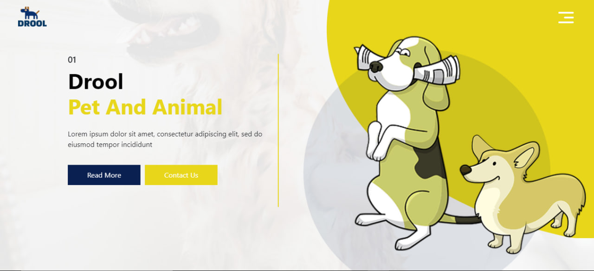

<h1 align="center">Drool Page</h1>

"Drool Page" is a web project developed using HTML, CSS, JavaScript and Bootstrap. This project offers a platform specially designed for dogs. It has three main sections: a section where various foods and foods for dogs are displayed, a communication section where users can communicate, and an about section where the details of the project and the team are introduced. One of the features that makes the project stand out is that it is designed to adapt to different screen sizes. This means that users can easily access via computers, tablets and mobile devices. The name of the project, Drool Page, offers this rich content and user-friendly experience for dog owners.

<h2> 🍿 Features </h2>
<ul>   
<li>Responsive</li>
</ul>

<h2> 🍿 Technologies </h2>
<ul>
<li>HTML</li>
<li>CSS</Li>
<li>JavaScript</li>
<li>Bootstrap</li>
</ul>

<h2>🍿 How to Run the Website on Your System </h2>
<h3> Step 1: Download and Extract the Code </h3>

First, download the entire website code and extract the ZIP file to a folder on your local system.

<h4>Website Code: https://github.com/BilgeGates/Drool-Page.git</h4>
<h3>Step 2: Launch the website </h3>

You can run it by going to the folder where your code is, and clicking on the index.html file, or you can open it in your code editor and run it in `Live Server`

<h2>🍿 Demo </h2>

 - Check out our live demo at https://drool-page.netlify.app/ 

